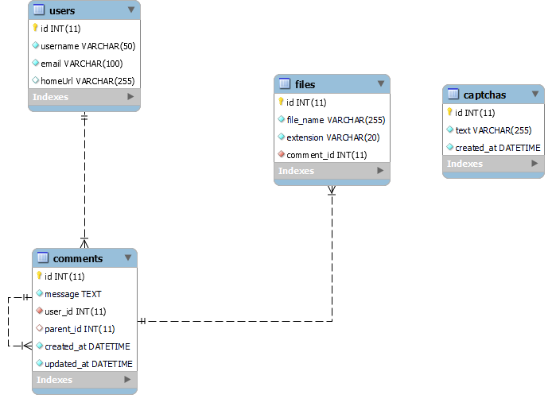

@@ -17,3 +17,20 @@ docker-compose up
### Server will be available at http://localhost:8000/

## About

Test task for dzenCode.

The whole project is wrapped in docker and run with one command. These ports need to be freed: 5432, 6379, 8000, 8001, 3000, 5050

## Server:

1.  DB: PostgreSQL
2.  ORM: Prisma
3.  Framework: express
4.  Websockets and Static server
5.  Additional: jwt, events, queue using bullmq and redis, cache using node-cache
6.  Db schema: 

## Client:

1.  React
